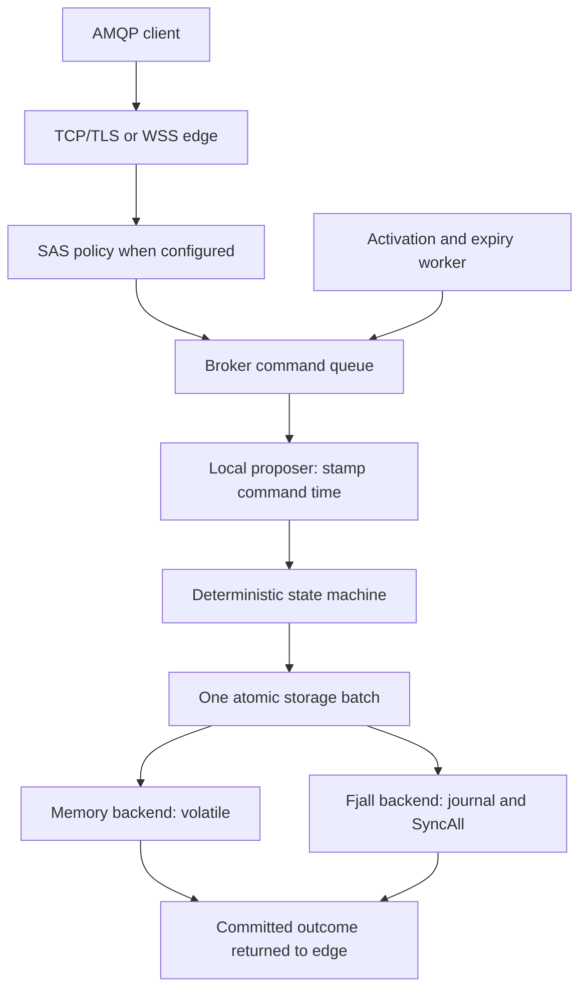
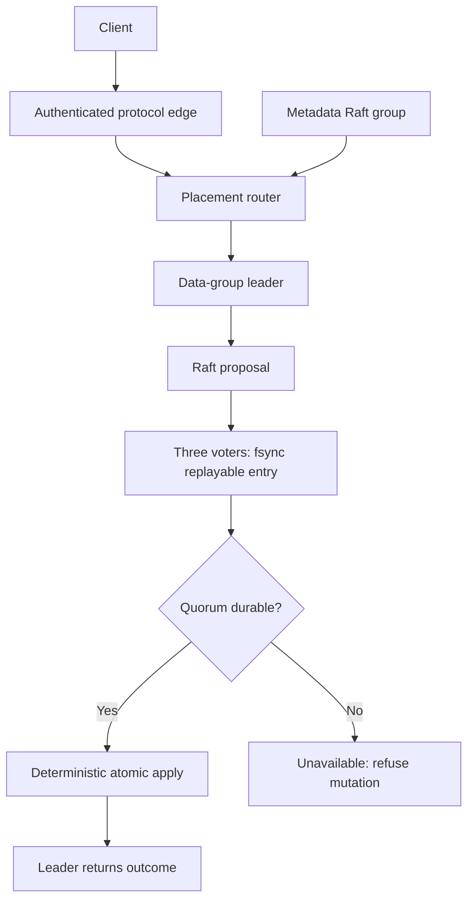

# Switchyard Architecture

## Current Runtime

Switchyard is pre-alpha and single-node. One namespace reaches the deterministic
state machine through the repository-owned AMQP engine and local proposer. Fjall
survives restart; memory does not. Neither survives loss of its only node.
Configured voters validate startup policy but do not start Raft or establish quorum.

The edge accepts only after apply succeeds; durable acknowledgement requires
Fjall. Commands carry timestamps; rejection writes nothing. See
[server](crates/server/src/lib.rs),
[proposer](crates/server/src/proposer.rs), and
[state machine](crates/domain/src/machine.rs).

### Protocol And Identity

The edge owns framing, links, credit/drain, settlement, SASL, and Service Bus
entity/annotation/`$management` mappings. SASL PLAIN or ANONYMOUS/`MSSBCBS` then
CBS SAS provides Send/Listen/Manage authorization. Expired grants close links;
initial authorization has a deadline. TLS precedes AMQP; WSS carries binary
AMQP at `/$servicebus/websocket`.

Accepted native connections retain their original driver and reader handles.
Sticky stop bypasses bounded commands and interrupts driver IO/channel waits
before normal link cleanup. `shutdown` joins both and caches results across
canceled waiters; Drop requests stop without joining. Joined shutdown is not a
peer Close acknowledgement. Sender-capacity waits observe Detach and command
closure. Full task-family ownership, connection admission/pre-open deadlines,
and process signals remain planned.
See [native custody](crates/amqp/src/server/tasks.rs) and the
[shutdown sequence](docs/roadmap.md#next-main-increments).

Namespace, queue, topic, and subscription names are ASCII case-insensitive in
typed identifiers, storage, AMQP addresses, and entity-scoped SAS audiences.
Session and placement identifiers remain case-preserving. The native gRPC API
and CLI are scaffolds; no entity administration listener exists. JWT/OIDC,
mTLS, transactions, and Atom/XML administration are not implemented.

### Message State

| Implemented area | Contract |
| --- | --- |
| Peek-lock | Lock commits before delivery; completion commits deletion. At-least-once delivery. |
| Receive-delete | Deletion commits before transfer. At-most-once delivery. |
| Atomic batches | Every child validates before one commit; failure consumes no sequence or history. |
| Sessions | Exclusive session lock and durable opaque state; FIFO only within a session. |
| Scheduling | Topic/queue placeholder is browseable but not receivable; activation assigns an active sequence and starts TTL. |
| Deferral and peek | Deferred records require explicit retrieval; peek is read-only and sequence-ordered. |
| Duplicate detection | Queue-scoped exact non-empty message IDs suppress copies for a deterministic history window. |
| Topics | Publication and matching subscription copies commit atomically; subscriptions use the queue lifecycle. |
| DLQ | A reserved queue drained by ordinary receive/settlement; no cascading dead-lettering. |

Immediate topic publication evaluates subscriptions and rules at command apply.
Scheduled publication stores only a topic-owned placeholder: subscriptions and
rules are evaluated at later activation, not send time. Each subscription starts
with `$Default`; actionless true/false/correlation rules use OR across rules and
typed AND within a correlation filter. Multiple matches produce one copy. A
publication with no matches succeeds without retaining an active copy. Payloads
are copied per subscription; shared payload storage is not implemented.

Routing proves the complete listed subscription set, including exact canonical
membership bytes, parent-derived backing configuration, and the real DLQ
profile, before exposing a page or committing copies. A 2,001-entry lookahead
enforces the 2,000-subscription cap. Present configurations and listed profiles
require private live owner heads; DLQs share their owner's head. Bound broker
calls retain an opaque owner/target identity and recheck it before host or stored
Clock, including configuration-free commands. Legacy name/wire calls, timers
and raw catalog/diagnostic reads remain unfenced; no global orphan scan is added.
See [topic routing](crates/domain/src/machine/topic.rs) and the
[compatibility differences](docs/compatibility.md#known-differences-and-bounds).

### Time And Storage

The timer proposes bounded activation and lock, TTL, session-lock, and duplicate
sweeps. Independent cursors isolate entity failures; saturated scans continue
immediately. The proposer holds time still for small host-clock regressions and
refuses larger ones, logged/retried but not wired to readiness. The state machine
rejects regressing command time.

Fjall uses one `records` keyspace for domain keys and `meta` for a big-endian
layout marker. Atomic batches are journalled and fsynced before apply returns;
snapshots cannot observe a partial batch. A directory has one live owner.
Missing markers are initialized only if both known keyspaces are empty; any
existing row, including an empty value, refuses opening without adding a marker.
Active format 2 requires owner metadata; format 1 refuses even when empty.
There is no migration, foreign-keyspace validation or filesystem-byte guarantee.

The domain uses big-endian keys and V1 value envelopes. Memory and Fjall share
the storage contract and paired tests. Split production keyspaces, replicated
logs, quota accounting, encryption, and snapshot installation remain planned. See
[storage](crates/storage/src/lib.rs) and
[Fjall opening/apply](crates/storage/src/durable.rs).

## Production Target: Not Implemented

The intended release is a Rust-native Linux broker with quorum durability,
multi-tenant isolation, and Standard-compatible queues/topics. The design below
is a requirement for future work, not an available deployment configuration.
The server runtime, storage, and TLS must avoid RocksDB, OpenSSL, and system TLS.

### Placement And Durability

- At least three odd-numbered cluster voters; three replicas per placement group.
- A queue has one group by default. A topic, its subscriptions, and rules share
  one group so fanout is atomic.
- Immutable explicit placement permits same-group transactions. Partitioned
  entities and cross-group transactions are outside the first release.
- Metadata owns membership, namespace policy/quotas, placement, compatibility,
  and backup/audit configuration, never message bodies.
- Edge connections and AMQP link state remain local; messages, locks, sessions,
  and settlements become replicated state.
- Acknowledgement requires a quorum-fsynced replayable entry plus leader apply.
  Without quorum, mutations, lock-acquiring receives, and consistent management
  reads refuse with retryable availability errors.
- Moves require learner snapshot/catch-up, joint-consensus promotion, then
  removal. Applied indexes/snapshots fence log compaction.

Transactions stage invisible operations and commit in one same-group batch;
disconnect/lease expiry aborts them. Cross-group forwarding instead needs a
durable source outbox, idempotent destination command, and completion marker:
at-least-once forwarding, not distributed atomicity.

### Isolation, Security, And Recovery

Namespaces will be mutually untrusted. Bounded storage leases, rate allocations,
and weighted scheduling must enforce quotas/fairness; limits refuse sends,
never evict live messages.

OIDC and mTLS/SPIFFE mappings will supplement SAS. Per-namespace AES-256-GCM keys
will protect bodies, properties, session state, credentials, and sensitive IDs;
keyed digests protect equality indexes. Routing/sequencing may remain plaintext.
External KMS must retain wrapped versions for reads, rotation, backup, and restore.

Audit will exclude sensitive content, form per-group hash chains, and export
signed batches to configured WORM storage/telemetry. Compliance mode will require
TLS, external KMS, complete auditing, encrypted backups, and fail-closed bounded
audit backlog. Every authentication decision, admin change, message operation,
backup, restore, and export must be audited. These are planned controls, not certification. See
[threat model](docs/threat-model.md).

Encrypted snapshots and immutable committed-log archives will support
point-in-time restore into an empty cluster. Signed manifests must pin metadata,
membership, applied indexes, checksums, and key versions, verified before
installation. Quorum, disk, clock, KMS, audit backlog, and backup freshness will
feed readiness/alerts. Exporters remain operator-configured.

## Completion Gates

The [roadmap](docs/roadmap.md) owns issue status and dependencies. The release
contract remains unfulfilled until these independent gates pass:

- [ ] Current/previous pinned .NET and pinned Sift data/administration gates;
  differential checks for supported behavior, not blanket compatibility claims
- [ ] Crash/fsync/snapshot recovery and partition/leader-change replay tests
- [ ] Authorization, hard quotas/fairness, KMS outage/rotation, and audit integrity
- [ ] Corrupt-backup refusal, empty-cluster restore, and rolling-upgrade checks
- [ ] Parser fuzzing, model/property tests, and protocol/configuration golden vectors
- [ ] Signed Linux x86_64/arm64 binaries/images, SBOMs, and deployment guidance
- [ ] Published reference-hardware evidence: 5 TiB retained-data compaction,
  failover, backup, and restore soak; 100,000 aggregate durable 1 KiB messages/s,
  three replicas, encryption/audit,
  NVMe/10 GbE, and send acknowledgement below 20 ms p99

Version 1.0 is reserved for passing compatibility, durability, security, recovery,
and performance gates. Premium features, cross-region replication, a browser
dashboard, a Kubernetes operator, and non-Linux production servers are not
initial release commitments.
