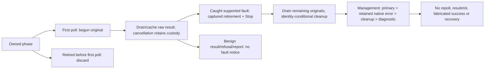

# Compatibility

Switchyard targets Azure Service Bus Standard. This describes single-node `main`,
not reference branches; core/protocol/client gates establish tested behavior,
not compatibility certification.

## Client Gates

| Client | Evidence |
| --- | --- |
| Official .NET | Four opt-in experimental Memory TCP/WSS gates: declared-current ServiceBus 7.21.0 / Core 1.62.0 and previous 7.20.2 / 1.60.0, not latest. Isolated locked graphs/roots; approved ServiceBus/Core, output and nonce-bound loaded-file bytes; completion after async disposal. |
| Rust AMQP | Broader protocol end-to-end suites, not official-SDK substitutes. |
| Pinned Sift | Planned; no gate. |

.NET gates cover queue/batch send, prefetch/settlement, receive-delete, envelopes,
renew/abandon/defer/peek, DLQ, sessions/state, duplicates, scheduling/cancellation,
filtered subscriptions, rules and case-insensitive addresses. Linux/.NET 10/NuGet
restore are required; missing prerequisites fail. Workspace runs ignore these
workflows; durable coverage is pending. TCP uses a permissive generated-identity
callback; WSS instead uses platform trust and child-scoped `SSL_CERT_FILE` root,
without machine-wide changes. Neither certifies production trust, administration
or whole-test task-tree shutdown. See [selectors/limits](sdk-gates.md),
[TCP](../crates/server/tests/amqp_dotnet_current.rs),
[WSS](../crates/server/tests/amqp_dotnet_websockets.rs) and
[declared project](../crates/conformance/dotnet-current/Switchyard.Conformance.DotNetCurrent.csproj).

## Implemented Surface

| Area | Contract |
| --- | --- |
| Transport/auth | AMQP 1.0 TCP/TLS; binary WSS `/$servicebus/websocket` (`AMQPWSB10`/`amqp`); development-only plaintext. TLS precedes AMQP; SASL PLAIN or ANONYMOUS/`MSSBCBS`, then CBS SAS. |
| Rights | Namespace/entity Send, Listen, Manage (includes both). Send for scheduling/cancellation; Listen for receive management. CBS grants are connection-wide, expire links, and allow 20s initial authorization. |
| Delivery | Singular/atomic batch send; peek-lock (unsettled) or receive-delete (pre-settled); independent out-of-order settlement; bounded prefetch/drain. Credit is reserved before mutation, empty results release it, and consumption/release completes drain. |
| Envelope | Durable AMQP body/forms, identifiers, properties, annotations, application properties/footer; broker-authoritative delivery overlays. |
| Management | Renew, abandon, defer/retrieve, ordered peek, schedule/cancel, custom dead-letter and DLQ receive/complete. Unsupported requests reject with compatible conditions/retry hints. |
| Sessions | Named/next-available attach echoes identifier/deadline; exclusive locks, opaque state, release on close. Renewal/state use `$management`, not automatic renewal. |
| Duplicates | Exact non-empty message IDs across immediate/batch/scheduled sends; bounded history expiry. |
| Profiles | Domain-only partial ordinary-queue updates atomically validate/change parent and exact DLQ profiles plus Clock. No-op patches write nothing; owner, records/deadlines remain. Session/duplicate modes are immutable; lock/TTL/message-size/history changes govern future work. |
| Topics/rules | Non-session immediate/scheduled singular/batch fanout; placeholder peek/cancel; independent subscription queues. Durable `$Default`, actionless true/false/correlation, typed equality; create/delete/paginated AMQP rules. |
| Time/identity | Bounded activation/lock/TTL/session-lock/history expiry. ASCII-folded namespace/entity/subscription addresses and SAS scope; session/placement IDs retain case. |
| Local APIs | [Offline RS256 JWT](offline-jwt.md): pinned keys, injected time/local rights, issuer-qualified grants; SAS/PLAIN retain verified namespace-host qualification. [SQL kernel](sql-predicates.md): bounded ephemeral local grammar/errors, IN/LIKE/scalar arithmetic. No JWT wire activation or persisted SQL rules/fanout/actions. |
| Storage | Paired Memory/Fjall semantics; Fjall journal fsync before applied outcomes; exclusive directory ownership. |

Selected operational queue-profile reads validate after decode/owner proof,
including backing queues/DLQs; invalid limits are corruption. Unread rows/raw
catalogues are not certified; profile-free legacy operations remain unchanged. Topic/subscription
profile propagation, administration setters/capacity, JWT consumers [#71](https://github.com/DeandreT/switchyard/issues/71)
and activation [#17](https://github.com/DeandreT/switchyard/issues/17), typed content
#16 and rule integration #20/#21 remain pending.

## Known Differences And Bounds

| Behavior | Current contract |
| --- | --- |
| Session ID on ordinary queue | Refused (Azure ignores it); only session queues promise FIFO. |
| Session settlement | Live message token/deadline suffice after session-lock loss; Azure also requires session ownership. |
| Next session | At most 32 candidates; all held returns unavailable/retry, not a full walk. |
| TTL | Always DLQs as `TTLExpiredException`; Azure's configurable expiration policy defaults off. Live locks remain settleable until expiry. |
| Duplicate gaps/history | Suppression consumes acknowledgement sequence slots, stores no message. History starts at command time; hits do not extend it, nor settlement/cancellation/expiry/DLQ erase it. Missing raw-AMQP IDs bypass it. |
| Scheduled topics | Children/rules snapshot at activation: later subscriptions may receive older publications. All-scheduled sends do not prove topology early. |
| Browse/deferred | Positive signed peek count, reply cap 250, scan to cap/end; deferred retrieval atomically accepts at most 32 sequences in caller order. |
| Service limits | 2,000 subscriptions/topic; separate topic/subscription name bounds; Standard default 256 KiB wire-message limit. Commercial namespace/operation quotas absent. |

### Atomicity And Lifecycle

Commands carry time and commit one batch. Rejection changes no messages, counters,
history or Clock; validation precedes allocation/history mutation. Session batches
share one session. Deduplication suppresses sends, not lock redelivery.

Opt-in indexed apply atomically commits effects/Clock/checkpoint. Both it and the
opt-in journal retire before storage apply; only success and cache updates restore
usability. Returned storage-apply errors or explicitly caught storage-apply unwinds
require reopen. With external exclusive writes, journal reopen reads append
presence/commit frontier; indexed reopen exposes an unapplied index or outcome-free
latest duplicate. Neither recovers a panic or provides quorum/power-cut guarantees.

Peek-lock commits ownership before transfer and deletes only on settlement;
receive-delete deletes first. Renewal preserves
live tokens; abandon/expiry redeliver until `MaxDeliveryCountExceeded` DLQ.
Deferral hides ordinary receive; deferred abandon/expiry restores deferral.
Management/delivery property updates persist. Peek never locks/increments delivery;
ordinary receivers browse sessions, held-session receivers browse only their own.

Scheduled placeholders are browseable, not receivable/session-available. Activation
retires them, allocates active sequence/enqueue time and starts TTL. Atomic topic evaluation
ORs rules, ANDs populated exact-typed correlation fields, makes one copy despite
multiple matches and succeeds without matches. Full copies settle/expire/defer/
browse/DLQ independently.

Reserved `entity/$deadletterqueue` permits no direct create/send or shadow-of-shadow.
Messages keep sequence/reason, lose lifetime/session, never DLQ again. Reasons use
`DeadLetterReason`/`DeadLetterErrorDescription`; direct drain omits Azure's forwarded
`DeadLetterSource`. No resubmission/forwarding.

### Topic Integrity

Routing/pages validate the full listed graph before prefixes or copies: each key/value
names the exact canonical child, with valid parent-derived backing profiles and matching DLQs (`u32::MAX`
delivery count, no TTL/session/dedup), no topic conflicts. The 2,001-entry scan
enforces 2,000; corruption refuses atomically, including beyond small pages.
Creation refuses orphan membership/occupied DLQs. Unindexed backing queues,
orphan rules/retained runtime, retained-message/rule deletion fences, live incarnations
and capacity are outside proof; formats unchanged. See [routing](../crates/domain/src/machine/topic.rs).

Selected rule reads retain keys, decode the bounded scan before overfull refusal,
then require exact generated key/name matches and valid canonical filters.
Key/filter violations are corruption; no row is rewritten. Unread rows and stored
timestamps are outside proof.

### Storage And Runtime Limits

Fjall restart preserves messages, locks/counts, sessions/sequences, not node loss.
Memory is volatile; no replication. Production durable startup returns static
replication-unavailable before storage/listeners; production Memory refuses too. Development is single-node;
CLI TLS/auth/storage/cluster error precedence is unchanged.

Missing markers are stamped only if known `meta`/`records` are empty; any row
(even empty-valued) refuses without marker mutation. Format 2 requires private
live owner heads; format 1 refuses even empty. Value envelopes remain V1; no
migration/foreign-keyspace proof/byte-invariance claim. See [opener](../crates/storage/src/durable.rs).

Configurations/listed topic profiles require canonical live heads; DLQs share
owners. Bound calls capture immutable namespace/target/owner/kind/generation through
the owner queue; scope mismatch comes first. Live/forbidden-shadow heads,
generation/target profile precede host/stored Clock, including Complete and session
state/release. Malformed heads are corruption; missing targets/same-kind generation
drift are stale. No whole-store/parent-membership/global corruption-priority proof
or live deletion. Wire/timers/legacy/raw diagnostic adoption awaits #57-#60.

Natural retirement/outer-pump panic custody is owner-scoped, not whole-task-tree
shielding (Send uses per-delivery pump panic custody):

| Owner | Acquisition and drain contract |
| --- | --- |
| Native connection | Capacity-free sticky Stop interrupts IO/channels. Shutdown joins original driver/reader and caches cancellation/repeat results; outer panic keeps acceptance/Close packets. Retirement discards unstarted work, starts no Close; Drop requests Stop only. Joins do not acknowledge Close; peer reply is required. |
| Native sender/credit | Detach/command closure interrupts capacity waits with all 256 permits held. Queued grant replies own cleanup before observation; dropped accepted replies clean exact reservations, not replacement credit. |
| Control-link admission | Retains one borrowed acceptance, typed route/refusal and raw results through cancellation/panic. Retirement discards unstarted work and drains begun originals; cleanup removes only the captured route. Active primary faults request captured Stop before drains. Adoption hands the same spawned task to its session family. |
| Session link family | Retains original data/CBS/management handles and raw leaf results. Live success history is consumed; retirement freezes admission and joins the same children. Cancelled borrowed finish keeps cached packets. Active parent panic/error requests captured Stop before drain; child errors and report-only exits do not notify. Priority: parent panic, parent error, child JoinError, leaf error, bridge fault, diagnostic panic. No session-level Stop or finite join latency. |
| Receiving | Retains one Receive/credit, begun Transfer/Delivery/reservation and at most 32 original workers. Retires intake/native/workers before drains; late Pending joins its retired worker. Fresh raw drain faults cache before captured Stop and remaining waits; old packets/benign exits/refusal/reporting do not notify. Ready auth/settlement rules remain; second-mode success follows durable settlement. Unanswered remote/confirmation waits retire; begun broker work drains. Exact registration removal precedes one lazy original session release; Drop only retires/detaches. |
| Attachment/session registry | Retains original grants/acceptance/readiness through entry preparation/move-only adoption. Claim before first helper await; installation rechecks newest claim and original End/Detach under row admission. Failed newest claims preserve installed rows, never revive older work. Fresh poll panics/non-RemoteDetached native drain errors cache before captured Stop and remaining waits; old results/ReleaseSession refusal/reporting do not notify. Cancelled cleanup keeps exact unregister and lazy captured entity/full-hold release; refusal leaves expiry. No atomic link/hold liveness or successor-family custody. |
| Send/Batch | Retains original command/raw result/native Accept/Reject/Unauthorized Close through natural/per-delivery panic cleanup. Fresh original-drain panics cache before captured Stop and remaining waits; returned late errors/old packets/reporting do not notify. Selected Detach/auth late native results remain benign; reporting panics suppressed, genuinely panicked originals remain faults. No replacement/rollback/new late acknowledgement; cancelled queued acknowledgement need not be unsent. |
| Management | Discards uninvoked preparation; retains begun commands/post-result registry work, native acknowledgements/replies/confirmations, both reply/Close outcomes and captured route. Newly caught original panics/newly completed native errors cache before captured Stop and remaining waits, independently per reply/Close branch. Old terminal results/prior panic slots do not notify on retry. Primary/native errors outrank cleanup faults; refusal/reporting does not notify. No new late reply/confirmation. |
| CBS | Retains original validation/store, native work/completed packets through captured-route cleanup. Fresh native drain errors/raw panics cache before captured Stop and route cleanup; old packets/status/refusal/reporting do not notify. Bootstrap needs no grant. No installed-grant rollback, route retry/new acknowledgement/second confirmation. |

Priority/notice scope is owner-specific: management/CBS returned exits close captured
channels and identity-unregister; original native errors precede cleanup. Connection,
management/CBS/attachment primary/native faults precede diagnostics; attachment
Detach and selected Send late-native exits retain the exceptions above. The six
data/CBS/management leaves and attachment guard signal primary faults before drains;
receiving includes retained worker faults and keeps its cause through best-effort
error Close. Cleanup notices #173-#177, management freshness #196 and control-link
admission #189 are merged. Non-notifying
retirement/refusal and reporting-only faults retain the owner-specific policies above.

Borrowed cancellation keeps phases/handles/raw results; panicked originals are
terminal, not repolled/retried/recovered. Receive/session-grant invocation begins
inside original first poll (including eager adapters), not an enqueue receipt.
Begun acceptance may still hand off a Session (#133). Late Receive starts no
Transfer/implicit settlement: peek-lock expires; receive-delete may be lost. Auth
retirement never rolls back begun Transfer. Receiving prepares one settlement context while
Receive/registration remain owned, before native start; active/one late adoption
move it, never retry failed broker cloning.

Captured row-locked delivery identity fences worker/residual cleanup and management
renewal/disposition; equal-value/cross-entity replacements survive. Cancelled residual
cleanup retains handles until removal; lookup/TTL purge/delayed-install order stay.
Session cleanup matches owner/entity/full hold. Original End observes End/Stop/driver
panic even during row-held auth/registry preparation, proving neither End answer
nor native joins; receiving auth sees captured Detach before Receive.

Session-owned link families #132 are joined. Connection-owned sessions
[#133](https://github.com/DeandreT/switchyard/issues/133), completing
[#75](https://github.com/DeandreT/switchyard/issues/75), and
[#7](https://github.com/DeandreT/switchyard/issues/7) process shutdown remain
[roadmap work](roadmap.md#next-main-increments). No aborted-ancestor
protection, graceful Close acknowledgement or finite broker/cleanup latency.

Sustained traffic beyond initial credit is uncertified: [#68](https://github.com/DeandreT/switchyard/issues/68)
windows/[#69](https://github.com/DeandreT/switchyard/issues/69) refill and
[#77](https://github.com/DeandreT/switchyard/issues/77) Flow echo remain absent.
Timer commands drive expiry/activation, not wall-clock mutation. Small clock
regressions hold time; large ones refuse/retry without readiness signal. One
namespace/server; no quotas, fair multi-tenancy or production durability.

## Not Implemented

| Scope | Missing |
| --- | --- |
| Semantics | General SQL/actions, session subscriptions/session-ID predicates, topic duplicates, configurable TTL, DLQ forwarding/resubmit, same-group transactions. |
| Administration | Atom/XML entities/rules; native gRPC/CLI transport (contract only). |
| Security | JWT consumers/wire, network OIDC, mTLS, policy/full RBAC, namespace KMS/encryption, tamper-evident audit. |
| Production | Raft/placement, quotas/fairness, encrypted backup/restore, readiness/observability, release/performance evidence. |

Partitioning/cross-placement transactions are later scope; geo-replication/Premium
are not initial commitments. See [roadmap](roadmap.md) and [target design](../ARCHITECTURE.md).
