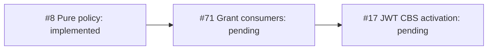

# Offline JWT Policy

`auth::JwtPolicy` is an immutable local verifier ([#8](https://github.com/DeandreT/switchyard/issues/8)),
not an enabled listener, CBS token type or CLI configuration. No network lookup,
signing API or OAuth/RFC 9068 access-token compatibility is promised.



## API

```rust
let policy = auth::JwtPolicy::from_json(configuration)?;
let requested = auth::ResourceScope::parse("amqps://tenant.example/orders")?;
let grant = policy.validate(token, &requested, now_epoch_seconds)?;
```

Time is caller-supplied unsigned epoch seconds, with zero skew and no wall-clock
lookup. The configured deployment audience is distinct from the requested scope.

## Configuration Shape

This public-modulus placeholder is intentionally invalid; replace it with a real
canonical unpadded base64url RSA modulus before loading this example.

```json
{
  "version": 1,
  "issuer": "https://issuer.example/", "audience": "urn:switchyard:tenant",
  "keys": [{"kid":"key-1","kty":"RSA","alg":"RS256","use":"sig",
            "n":"<INVALID_PUBLIC_MODULUS_PLACEHOLDER>","e":"AQAB"}],
  "bindings": [{"subject":"producer","scope":"amqps://tenant.example/orders",
                "permissions":["send"]}]
}
```

Version 1 has one exact HTTPS issuer and audience, 1-8 unique key IDs and 1-64
unique subjects. Each subject has one scope and 1-3 unique `send`/`listen`/`manage`
rights; Manage includes Send and Listen. Token role/scope claims cannot grant rights.
Scopes retain existing `ResourceScope` AMQPS hierarchy and ASCII-folding behavior.

## Accepted Profile And Bounds

Header fields are exactly `alg: RS256`, configured `kid`, and `typ: switchyard+jwt`.
Keys are odd 2048-4096-bit RSA moduli without leading zeroes, exponent 65537.
Required claims are `iss`, `sub`, `aud`, unsigned integer `iat`/`exp`; optional `nbf`
is an unsigned integer, never null. `aud` is a string or 1-8 unique strings. Issuer, subject and
audience match exactly. Lifetime is 1-3600 seconds; `nbf < exp` and validation
requires `max(iat, nbf or iat) <= now < exp`. Unknown claims grant no privileges.

Limits: config 64 KiB; token 8 KiB; decoded header/claims 2/6 KiB; JSON depth 8;
config/header/claims nodes 2048/64/256; key ID 128 bytes, subject 512 bytes,
issuer/audience/resource 2 KiB. Duplicate decoded JSON names are refused at every
depth. Configuration/header unknown fields are refused. Compact segments must be
canonical unpadded base64url; JSON itself need not be canonical. Verification uses
the original signed bytes. Errors are static; policy/key and issuer debug output
is redacted, not a claim that grant subjects/scopes are hidden.

`AccessGrant::same_principal` compares JWT issuer plus subject, or SAS/PLAIN verified
namespace host plus key name, not scope. `is_valid_at`/`allows` enforce the stored
interval even if supplied time moves backwards; SAS/PLAIN validity begins at zero.
Consumer refresh/time adoption (#71) and transport activation (#17) remain pending.
