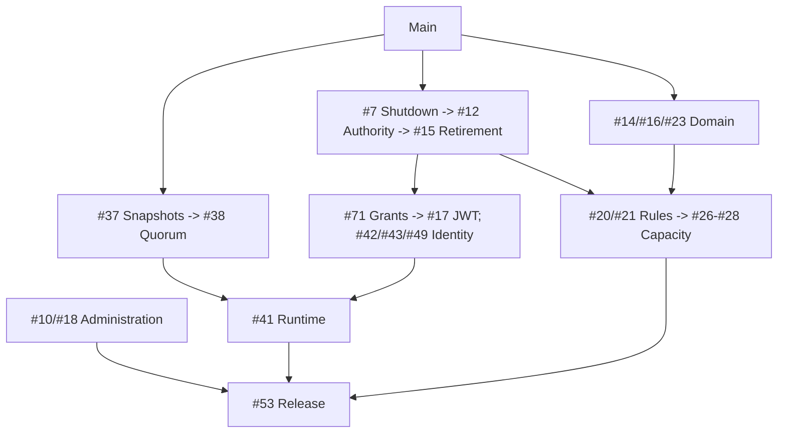
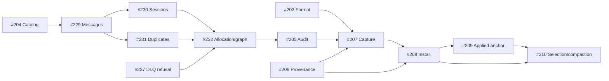

# Completion Roadmap

Pre-alpha: only verified, merged `main` is complete.
[Issues](https://github.com/DeandreT/switchyard/issues) own scope;
[compatibility](compatibility.md) records guarantees.

## Main Progress

- [x] AMQP/SASL/CBS; settlement, DLQ, deferral, peek, sessions, scheduling, queue duplicates.
- [x] Actionless topics/rules, bounded topology and selected profile integrity.
- [x] Memory/Fjall format-2 and opt-in journal/indexed apply/local replay.
- [x] Local authority, JWT/SQL kernels and native/link/session/connection custody.
- [x] Source-bound builds and pinned Memory SDK TCP/WSS gates.
- [ ] Remaining semantics, administration and conserved physical-byte capacity.
- [ ] Full recovery, quorum, multi-tenant security and measured release.

## Next Main Increments

#222 connection/#224 TCP are merged/verified; #225 WSS is assigned/unexecuted.
#134/#7 stay open.
#135/#136/#65 own admission/deadlines/process; joins have no Close/latency guarantee.
Reference branches are not main evidence or whole-branch ports (#15).

## Snapshot Recovery

#36 local replay is merged; #37 full recovery is not.

- [x] #203 Record format.
- [x] #204 Catalog validation (partial).
- [x] #206 Backend provenance.
- [ ] #205 State audit: assigned #229, then parallel #230/#231 and #232.
- [ ] #207 Coherent capture.
- [ ] #208 Offline atomic install.
- [ ] #209 Applied-safe anchor.
- [ ] #210 Selection/compaction.

#229 is unexecuted; #232 also depends on #227. #207-#210 remain blocked.
#227 DLQ refusal is merged/verified. #228 is assigned for allocation scoping,
not executed.

Partial validation is not full-state health or install authority. Capture needs
the complete image; install needs all-writer exclusivity. Prune at applied A,
not committed C; counters are not byte quotas.

## Parallel Pickup

Assign before coding. Serialize shared files and two-job builds; merge focused
PRs in dependency order ([workflow](../CONTRIBUTING.md)). Ready is not evidence.

| Lane | Pickup / overlap |
| --- | --- |
| WSS | [#225](https://github.com/DeandreT/switchyard/issues/225) assigned; listener/service. |
| Snapshots | [#229](https://github.com/DeandreT/switchyard/issues/229) assigned; parallel #230/#231 after its merge. |
| Domain | [#14](https://github.com/DeandreT/switchyard/issues/14)/[#16](https://github.com/DeandreT/switchyard/issues/16)/[#23](https://github.com/DeandreT/switchyard/issues/23) Ready/unassigned; serialize command/codec/keys. |
| Atom/admin | [#10](https://github.com/DeandreT/switchyard/issues/10)/[#18](https://github.com/DeandreT/switchyard/issues/18) Ready/unassigned; distinct paths. |
| SDK/security | #71/#101 blocked on #7. |

SDK evidence is experimental current/previous Memory, not latest/durable.
Production still refuses; quorum/recovery/runtime remain pending.
[Docs #236](https://github.com/DeandreT/switchyard/issues/236) waits for #234.

## Milestones

| Gate | Remaining work |
| --- | --- |
| [M1](https://github.com/DeandreT/switchyard/milestone/1) | Lifecycle, authority, profiles, reference retirement, typed content. |
| [M2](https://github.com/DeandreT/switchyard/milestone/2) | SDK/admin semantics, sustained Flow, capacity, same-group transactions. |
| [M3](https://github.com/DeandreT/switchyard/milestone/3) | Recovery/quorum, identity/fairness, encrypted audit/backup, measured release. |

## Completion Checks

- [ ] **Foundation:** live owner health, retained-authority fencing, bounded lifecycle
  and format refusal/reopen gates are merged; no stale path can mutate a new entity.
- [ ] **Compatibility:** declared current/previous SDK and administration clients
  exercise supported semantics, rules, sessions, TTL, modes and transactions;
  remaining deviations are explicit and unsupported requests refuse.
- [ ] **Capacity:** physical-byte conservation covers every queue/topic lifecycle
  and copy/error route; no public finite profile exists without its ledger.
- [ ] **Production:** all proposals/timers/consistent reads use real quorum routing,
  with no local fallback; quotas, identity, KMS encryption and committed audit pass.
- [ ] **Recovery:** full-state restart/install/compaction, partitions, key rotation,
  corrupt-backup refusal and empty-cluster restore pass under faults.
- [ ] **Release:** signed Linux x64/arm64 artifacts/SBOMs plus published three-replica,
  encrypted/audited 100k 1KiB messages/s and under-20ms p99 evidence; 5TiB soak
  includes compaction, failover, backup and restore on declared hardware.

[#53](https://github.com/DeandreT/switchyard/issues/53) reaches every lane. Executed
evidence, not code presence or skipped tests, closes gates; 1.0 stays reserved.
[Architecture](../ARCHITECTURE.md) retains non-goals: Premium, cross-group atomic
transactions, geo replication and regulatory certification.
