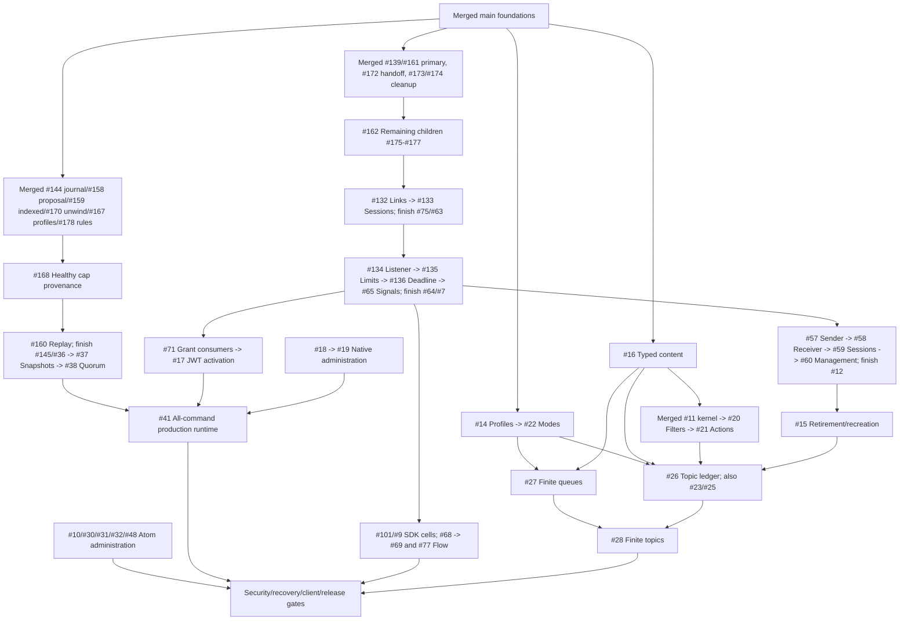

# Completion Roadmap

Switchyard is pre-alpha. This tracks merged `main`, not references/unmerged source.
[Live issues](https://github.com/DeandreT/switchyard/issues) own assignments,
acceptance and full dependencies; [compatibility](compatibility.md) owns guarantees.

## Main Progress

- [x] Repository-owned AMQP TCP/TLS/WSS, SASL/CBS SAS; queue batch/delivery/settlement,
  DLQ/deferral/peek, sessions/state, scheduling/cancellation/dedup; actionless topic
  fanout/rules/subscriptions and bounded listed topology ([PR #1](https://github.com/DeandreT/switchyard/pull/1)).
- [x] Ordinary profile updates #13 and selected profile integrity #167, not catalogue/
  whole-store health, administration or capacity. Immutable modes/retained deadlines.
- [x] Selected stored-rule key/filter integrity #178; bounded read/error ordering
  unchanged, no row repair or global catalogue proof.
- [x] Memory/Fjall/fsynced apply, unversioned refusal ([PR #4](https://github.com/DeandreT/switchyard/pull/4)),
  format-2 live heads/production refusal; opt-in journal #144 (full-prefix validation,
  ambiguous-write refusal), pure [proposal #158](../crates/domain/src/durable_proposal.rs)
  (frozen time/authority), [indexed apply #159/#170](../crates/domain/src/indexed.rs)
  (atomic effects/Clock/checkpoint, outcome-free latest duplicate, caught-apply-unwind
  retirement). External exclusive writes; no replay/quorum activation.
- [x] Bound API/pre-clock authority #56, not retained wire authority; pure
  [JWT](offline-jwt.md)/[SQL](sql-predicates.md), not activation/persisted rules.
- [x] Native Stop/original joins, Detach-aware admission/credit cleanup; first-poll
  receiving/Send/management/CBS custody, exact attachment/registry/End and delivery
  identities; outer-pump panic #111/#127-#131, primary notice #139/#161, move-only
  pre-native receiving context #172 and management/receiving raw cleanup notices
  #173/#174.
  No ancestor/family shielding; acquisition #73/data-link #84/CBS #74 complete.
- [x] Bounded SDK child/approved loaded-file custody, owned Cargo handoffs/unit CI;
  Linux frozen-input profile only. Four experimental Memory TCP/WSS gates use
  declared-current 7.21.0/1.62.0 and previous 7.20.2/1.60.0, not latest; workspace
  ignores four workflows/one restored-pin control. Eight durable/Memory cells #101/#9
  and administration certification remain pending; [commands](sdk-gates.md).
- [ ] Remaining semantics/administration/conserved capacity.
- [ ] Quorum, multi-tenant security/recovery and measured release.

## Next Main Increments

Finish cleanup notices, link/session families, listener/deadline/signals (#7), then
wire authority (#12) before retirement/recreation (#15). Joins do not acknowledge
Close; labels/source/reference tests do not prove completion or finite latency.
`feat/amqp-message-sections`/`feat/topic-mode-metadata` are references, not wholesale
ports. Fresh-main increments preserve key tags, the 2,000-child bound and error/
Clock contracts; never import format numbers or infer finite capacity from metadata.
Retire references only when capabilities are accounted for.

## Dependency Shape

One integration overview, not every prerequisite. "Merged" is the only completion
marker; linked issues carry exact scopes.

## Parallel Pickup

Assign first, merge prerequisites and split multi-PR scopes before implementation.
`status:ready` is a hint, not evidence. Serialize shared contracts/C# programs,
freeze verification inputs, reuse artifacts and serialize disk-aware two-job builds.
See [workflow](../CONTRIBUTING.md).

| Lane | Entry and overlap boundary |
| --- | --- |
| Lifecycle | [#162](https://github.com/DeandreT/switchyard/issues/162) remaining Send/CBS/attachment cleanup, then [#75](https://github.com/DeandreT/switchyard/issues/75) families; serialize listener/native/registry. |
| Domain ports | [#14](https://github.com/DeandreT/switchyard/issues/14) profiles, [#16](https://github.com/DeandreT/switchyard/issues/16) content, [#23](https://github.com/DeandreT/switchyard/issues/23) duplicates; serialize command/codec/key-tag/store fences. |
| SQL | [#20](https://github.com/DeandreT/switchyard/issues/20) after #16, then #21; serialize compiler/rules. |
| Replication | [#168](https://github.com/DeandreT/switchyard/issues/168) -> [#160](https://github.com/DeandreT/switchyard/issues/160); serialize domain/cluster/store, retain startup refusal. |
| Administration | [#10](https://github.com/DeandreT/switchyard/issues/10) Atom fixtures/profiles; [#18](https://github.com/DeandreT/switchyard/issues/18) native Create/Get/List/protobuf, no listener activation. |
| Deferred lanes | [#71](https://github.com/DeandreT/switchyard/issues/71) auth consumers then #17; [#101](https://github.com/DeandreT/switchyard/issues/101) SDK matrix (tests, not runtime fixes). Both await #7; serialize authorization/CBS. |

## Issue Index

Milestones index the backlog; `port` means reference-derived, not complete. Refresh
labels after prerequisites merge; verify children before closing coordinators.

### Safe Main-Line Foundations

[Milestone 1](https://github.com/DeandreT/switchyard/milestone/1): owner/store safety,
lifecycle #7, retained authority #12, profiles #13/#14, retirement #15, content #16.

### Client And Capacity Compatibility

[Milestone 2](https://github.com/DeandreT/switchyard/milestone/2): identity/SDK/Flow
#71/#17/#9/#101/#68/#69/#77; native/Atom/admin gates #18/#19/#29/#10/#30/#31/#32/#48/#50;
merged pure SQL #11/#95-#97 versus pending content/rules #16/#20/#21; held-session
settlement/renewal, fanout/TTL/duplicates #24/#25/#33/#23; finite/conserved capacity
#22/#27/#26/#28 (metadata is no ledger); restricted transactions/coordinator/
same-group placement/forwarding #34/#35/#39/#40, never cross-group atomicity.

### Production And Release Gates

[Milestone 3](https://github.com/DeandreT/switchyard/milestone/3): replay/snapshots/
quorum/runtime #36/#144/#145/#37/#38/#41; OIDC/mTLS/committed RBAC #42/#43/#49;
quotas/fairness #44; KMS -> audit/WORM -> backup #45/#46/#47; readiness #51,
fault/upgrade #52, signed/measured release #53. Demos/refusal do not complete gates.

## Completion Checks

- [ ] **Foundation:** live owner health, retained-authority fencing, bounded lifecycle
  and format refusal/reopen gates are merged; no stale path can mutate a new entity.
- [ ] **Compatibility:** declared current/previous SDK and administration clients
  exercise supported semantics, rules, sessions, TTL, modes and transactions;
  remaining deviations are explicit and unsupported requests refuse.
- [ ] **Capacity:** physical-byte conservation covers every queue/topic lifecycle
  and copy/error route; no public finite profile exists without its ledger.
- [ ] **Production:** all proposals/timers/consistent reads use real quorum routing,
  with no local fallback; quotas, identity, KMS encryption and committed audit pass.
- [ ] **Recovery:** full-state restart/install/compaction, partitions, key rotation,
  corrupt-backup refusal and empty-cluster restore pass under faults.
- [ ] **Release:** signed Linux x64/arm64 artifacts/SBOMs plus published three-replica,
  encrypted/audited 100k 1KiB messages/s and under-20ms p99 evidence; 5TiB soak
  includes compaction, failover, backup and restore on declared hardware.

[#53](https://github.com/DeandreT/switchyard/issues/53) reaches every lane. Completion
requires executed evidence, never skipped tests/code presence; 1.0 stays reserved.
[Architecture](../ARCHITECTURE.md) preserves non-goals: Premium, cross-group atomic
transactions, geo replication and regulatory certification are not added promises.
