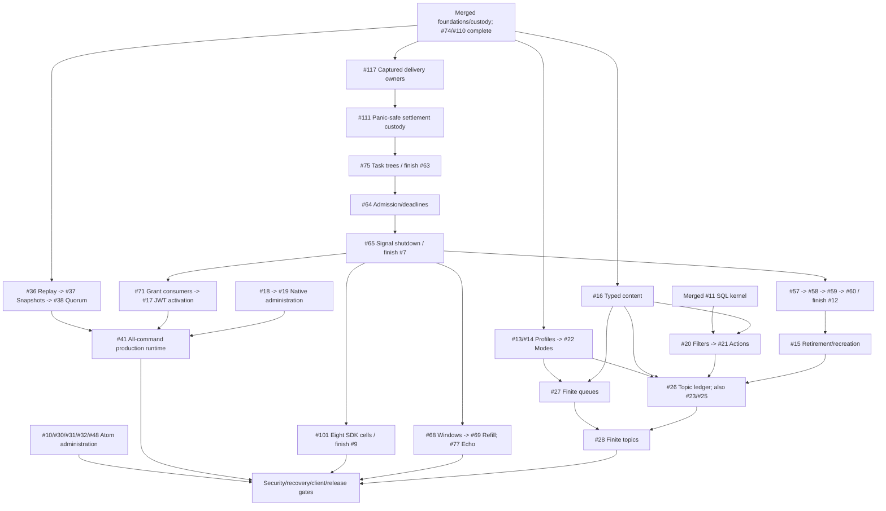

# Completion Roadmap

Switchyard is pre-alpha. This roadmap describes merged `main`, not reference
branches or unmerged source. [GitHub issues](https://github.com/DeandreT/switchyard/issues)
own live assignments, acceptance and full dependencies.

## Main Progress

- [x] Repository-owned AMQP engine; TCP/TLS/WSS; SASL/CBS SAS
- [x] Queue batching, both receive guarantees, settlement, DLQ, deferral and peek
- [x] Queue sessions/state, scheduling/cancellation and duplicate detection
- [x] Immediate/scheduled actionless topic rules and subscription delivery
- [x] Single-node memory/Fjall parity and fsynced durable apply
- [x] Bounded listed-topic topology proof ([PR #1](https://github.com/DeandreT/switchyard/pull/1))
- [x] Populated unversioned-store refusal ([PR #4](https://github.com/DeandreT/switchyard/pull/4))
- [x] Production startup refuses before storage/listeners without quorum (#5)
- [x] Private live owner heads and active format-2 store fence (#6)
- [x] Consumed bound broker API; pre-clock authority checks (#56); wire adoption pending
- [x] Original native driver/reader stop and joined shutdown (#62); wider lifecycle pending
- [x] Detach-aware sender admission; unchanged bounded capacity (#67)
- [x] Original settlement-worker custody through natural receiving-pump teardown (#72)
- [x] Original Receive/result/credit custody through natural teardown (#79)
- [x] Queued native-credit replies own cleanup before observation (#81)
- [x] Exact session-grant/native-attach handoff (#80); acquisition coordinator #73 complete
- [x] Original inbound Send/Batch custody through data-link retirement (#89)
- [x] Acquisition invocation starts inside the retained first poll (#91)
- [x] Original outbound starts and late Pending adoption (#90); data-link coordinator #84 complete
- [x] Fenced session registration and captured-owner cleanup (#87)
- [x] Original management command/reply custody and exact route cleanup (#85, [PR #112](https://github.com/DeandreT/switchyard/pull/112))
- [x] Original CBS token/native custody and captured reply cleanup (#86); pump coordinator #74 complete
- [x] Owned original End observation retires attachment/receiving preparation (#110)
- [x] Pure offline JWT policy and issuer-qualified grants (#8); [consumers/activation pending](offline-jwt.md)
- [x] Pure bounded SQL predicates, IN/LIKE and scalar arithmetic (#11/#95/#96/#97); [rule integration pending](sql-predicates.md)
- [x] Bounded Linux SDK child runs and loaded-file custody (#99)
- [x] Two exact SDK selectors and approved runtime assets (#100); [durable matrix pending](sdk-gates.md)
- [x] Content-aware owned Cargo handoffs (#105); Linux frozen-input profile only
- [ ] Remaining client semantics, administration and conserved capacity
- [ ] Real quorum, multi-tenant security, recovery and measured release gates

Actual evidence: four passing experimental Memory TCP/WSS SDK gates (two pins,
two transports). `declared-current` is ServiceBus 7.21.0 / Core 1.62.0; `previous`
is 7.20.2 / 1.60.0, not floating latest. Eight Memory/Fjall cells #101 and
coordinator #9 remain pending. Ordinary workspace tests ignore four workflows
and one restored-pin control; selected runs are reported separately. No durable
or administration certification. See [SDK gates](sdk-gates.md) and [compatibility](compatibility.md).

## Next Main Increments

1. Finish [#7](https://github.com/DeandreT/switchyard/issues/7): #117 captured
   delivery owners -> #111 panic-safe settlements
   -> #75 task trees -> #64 admission/deadlines -> #65 signal shutdown. #74 is
   complete; #75 completes #63. #73/#84/#87/#85/#86/#110 are merged; #117 is ready.
2. After #7, complete [#12](https://github.com/DeandreT/switchyard/issues/12):
   retained sender #57 -> receiver/settlement #58 -> sessions #59 -> management
   #60. Merged #56 alone is not retained wire authority.
3. Enable [#15](https://github.com/DeandreT/switchyard/issues/15) retirement/recreation
   only after #12; no live deletion/recreation claim yet.
4. Port safe profile updates and typed content independently, then dependent semantics.

Joins are not graceful Close acknowledgements; source, labels and reference
tests are not completion evidence. `feat/amqp-message-sections` and
`feat/topic-mode-metadata` are references, not wholesale ports. Fresh-main
increments must preserve key tags, the 2,000-child topic bound and error/clock
contracts. Do not import reference format numbers or infer finite topics from
metadata. Retire a reference branch only when its capabilities are accounted for.

## Dependency Shape

Integration paths, not every prerequisite. Nodes beyond merged foundations are pending.

## Parallel Pickup

Check live assignments. Each entry is a scoped lane, not its whole dependency
chain. Split multi-PR work into child issues before implementation.

| Lane | Entry And Boundary |
| --- | --- |
| Protocol | #117 captured delivery owners, then the ordered chain above; one listener/native/registry owner |
| SQL | #11 pure kernel complete; [#20](https://github.com/DeandreT/switchyard/issues/20) filters waits for #16 typed content, then #21 actions. Serialize compiler/rule paths; no retained integration yet |
| Auth activation | #8 policy merged; #71 -> #17 waits for #7. Serialize shared authorization/CBS files, not a current parallel pickup |
| Replication | [#36](https://github.com/DeandreT/switchyard/issues/36): cluster/storage/proposer replay; retain startup refusal, no quorum claim |
| Administration | [#10](https://github.com/DeandreT/switchyard/issues/10): Atom fixtures/profiles; [#18](https://github.com/DeandreT/switchyard/issues/18): native Create/Get/List service/protobuf. No listener activation |
| Domain ports | #13 profiles, #16 content, #23 duplicate history; serialize shared command/codec/key-tag/store-fence edits |
| Client/release evidence | [#101](https://github.com/DeandreT/switchyard/issues/101): test matrix after #7. [#123](https://github.com/DeandreT/switchyard/issues/123): helper unit CI after #105. Neither owns runtime fixes |

Assign before pickup; merge prerequisites first. `status:ready` is only a hint.
Serialize shared contracts and each C# program; freeze inputs during verification.
Reuse compatible artifacts, serialize two-job builds and check disk headroom.
See [contribution workflow](../CONTRIBUTING.md).

## Issue Index

Milestones index the full scoped backlog. `port` means reference-derived, not
complete. Update labels after prerequisites merge; verify every child before
closing its coordinator.

### Safe Main-Line Foundations

[Milestone 1](https://github.com/DeandreT/switchyard/milestone/1): store/owner safety,
bounded lifecycle (#7), retained authority (#12), queue/topic/subscription profile
updates (#13/#14), retirement (#15), typed content/copy overlays (#16).

### Client And Capacity Compatibility

[Milestone 2](https://github.com/DeandreT/switchyard/milestone/2) owns:

- Identity/CBS (#71/#17), SDK matrix (#9/#101), windows/refill/Flow echo (#68/#69/#77).
- Native administration (#18/#19/#29), Atom contract/HTTPS/Get/CRUD/rules
  (#10/#30/#31/#32/#48), administration-client gates (#50).
- SQL compiler -> filters -> actions (#11/#96/#97/#20/#21); typed content
  remains separate, not part of the pure compiler.
- Held-session settlement/renewal, session fan-out, configurable TTL and topic
  duplicate history (#24/#25/#33/#23).
- Capacity profiles -> finite queues/conserved parent-topic ledger -> finite
  topics (#22/#27/#26/#28); metadata is not a physical-byte ledger.
- Restricted queue transactions -> AMQP coordinator -> same-group placement ->
  forwarding outbox (#34/#35/#39/#40); no cross-group atomicity.

### Production And Release Gates

[Milestone 3](https://github.com/DeandreT/switchyard/milestone/3): committed replay
-> full-state snapshots -> quorum/routing -> all-command runtime (#36/#37/#38/#41),
OIDC/mTLS/committed RBAC (#42/#43/#49), namespace quota/fairness (#44), KMS
encryption -> audit/WORM -> backup/restore (#45/#46/#47), readiness/metrics (#51),
fault/upgrade gates (#52), signed/measured release (#53). Local demos and startup
refusal do not complete these gates.

## Completion Checks

- [ ] **Foundation:** live owner health, retained-authority fencing, bounded lifecycle
  and format refusal/reopen gates are merged; no stale path can mutate a new entity.
- [ ] **Compatibility:** declared current/previous SDK and administration clients
  exercise supported semantics, rules, sessions, TTL, modes and transactions;
  remaining deviations are explicit and unsupported requests refuse.
- [ ] **Capacity:** physical-byte conservation covers every queue/topic lifecycle
  and copy/error route; no public finite profile exists without its ledger.
- [ ] **Production:** all proposals/timers/consistent reads use real quorum routing,
  with no local fallback; quotas, identity, KMS encryption and committed audit pass.
- [ ] **Recovery:** full-state restart/install/compaction, partitions, key rotation,
  corrupt-backup refusal and empty-cluster restore pass under faults.
- [ ] **Release:** signed Linux x64/arm64 artifacts/SBOMs plus published three-replica,
  encrypted/audited 100k 1KiB messages/s and under-20ms p99 evidence; 5TiB soak
  includes compaction, failover, backup and restore on declared hardware.

[#53](https://github.com/DeandreT/switchyard/issues/53) reaches every workstream.
Completion requires executed evidence, not code presence or skipped tests.
Version 1.0 stays reserved until all gates pass. [Architecture](../ARCHITECTURE.md)
records the target and non-goals: Premium, cross-group atomic transactions, geo
replication and regulatory certification are not silently added to this release.
