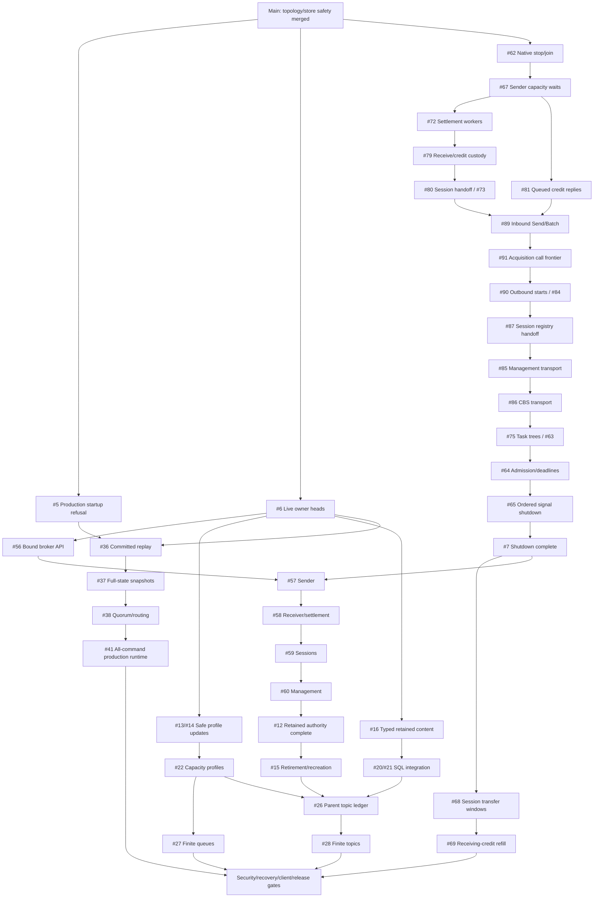

# Completion Roadmap

Switchyard is pre-alpha. This roadmap describes `main`; reference-branch tests
are not evidence that a capability has landed. GitHub issues are the live status
and assignment source. Milestones group work; independent lanes can run in parallel.

## Main Progress

- [x] Repository-owned AMQP engine; TCP/TLS/WSS; SASL/CBS SAS
- [x] Queue batching, both receive guarantees, settlement, DLQ, deferral and peek
- [x] Queue sessions/state, scheduling/cancellation and duplicate detection
- [x] Immediate/scheduled actionless topic rules and subscription delivery
- [x] Single-node memory/Fjall parity and fsynced durable apply
- [x] Complete bounded listed-topic topology proof ([PR #1](https://github.com/DeandreT/switchyard/pull/1))
- [x] Refusal of populated unversioned stores ([PR #4](https://github.com/DeandreT/switchyard/pull/4))
- [x] Production startup refuses before storage/listeners until quorum exists ([#5](https://github.com/DeandreT/switchyard/issues/5))
- [x] Private live owner heads with an active format-2 store fence ([#6](https://github.com/DeandreT/switchyard/issues/6))
- [x] Consumed bound broker API with pre-clock authority checks ([#56](https://github.com/DeandreT/switchyard/issues/56)); wire adoption remains pending
- [x] Original native driver/reader stop and joined shutdown ([#62](https://github.com/DeandreT/switchyard/issues/62)); wider lifecycle remains pending
- [x] Detach-aware sender admission with unchanged bounded capacity ([#67](https://github.com/DeandreT/switchyard/issues/67))
- [x] Original settlement-worker custody through natural receiving-pump teardown ([#72](https://github.com/DeandreT/switchyard/issues/72))
- [x] Original Receive/result/credit custody through natural teardown ([#79](https://github.com/DeandreT/switchyard/issues/79))
- [x] Native queued-credit replies own cleanup before observation ([#81](https://github.com/DeandreT/switchyard/issues/81))
- [x] Exact original session-grant/native-attach handoff ([#80](https://github.com/DeandreT/switchyard/issues/80)); acquisition coordinator #73 complete
- [x] Original inbound Send/Batch custody through data-link retirement ([#89](https://github.com/DeandreT/switchyard/issues/89)); outbound #90 remains
- [x] Acquisition broker invocation starts inside the retained first poll ([#91](https://github.com/DeandreT/switchyard/issues/91))
- [ ] Remaining client semantics, administration and conserved capacity
- [ ] Real quorum, multi-tenant security, recovery and measured release gates

The ordinary workspace gate excludes two opt-in SDK selectors; foundation-only
increments do not rerun them. Current .NET coverage is pinned 7.20.2 and
experimental Memory-only TCP/WSS, not durable or administration certification.
See [compatibility](compatibility.md).

## Next Main Increments

1. Finish [#7](https://github.com/DeandreT/switchyard/issues/7): outbound #90 completes data links #84, followed by registry #87, management #85 and CBS #86 under #74; task trees (#75/#63), admission/deadlines (#64), then signal shutdown (#65). Joins are not graceful Close acknowledgements.
2. Complete [#12](https://github.com/DeandreT/switchyard/issues/12) through sender, receiver/settlement, sessions, then management ([#57](https://github.com/DeandreT/switchyard/issues/57) through [#60](https://github.com/DeandreT/switchyard/issues/60)) using the bound broker API. Wire adapters wait for #7.
3. Enable [#15](https://github.com/DeandreT/switchyard/issues/15) only after retained authority is complete; no live deletion/recreation claim yet.
4. Port safe configuration and typed-content increments independently, then their dependent features.

`feat/amqp-message-sections` and `feat/topic-mode-metadata` remain reference
material, not merge units. Reimplement each issue on fresh `main`, preserve its
current key tags, 2,000-child topic bound and error/clock contracts, and prove
the focused change. Do not transplant reference format numbers or claim finite
topics from metadata alone. Retire a reference branch only after its remaining
capabilities are accounted for.

## Dependency Shape

The issue bodies contain the complete, acyclic dependency graph; this diagram
shows the main integration paths, not every edge.

## Parallel Pickup

These starting lanes have distinct boundaries; check live assignments before
pickup. Retained wire authority follows the merged core and connection-lifecycle prerequisite.

| Lane | Start | Boundary |
| --- | --- | --- |
| Retained sender | [#57](https://github.com/DeandreT/switchyard/issues/57) | Wait for #7; sender/listener ownership only |
| Connection lifecycle | [#63](https://github.com/DeandreT/switchyard/issues/63) | After #91; #90 -> #87 -> #85 -> #86 -> #75, then #64/#65 |
| Identity policy | [#8](https://github.com/DeandreT/switchyard/issues/8) | Pure `auth` policy; no listener/CBS activation |
| Client evidence | [#9](https://github.com/DeandreT/switchyard/issues/9) | Test harness and pin/custody records; no runtime changes |
| Administration contract | [#10](https://github.com/DeandreT/switchyard/issues/10) | Scrubbed fixtures/closed profiles; no serving endpoint |
| Rule compiler | [#11](https://github.com/DeandreT/switchyard/issues/11) | Isolated parser/evaluator; no command/codec/fan-out integration |

Before starting, assign the issue to yourself and check that its dependencies
are merged. `status:ready` is a pickup hint, not permission to edit shared files.
Coordinate one owner at a time for `command.rs`/codec/key tags/store fences,
broker/proposer, listener/CBS, and each C# client program. Do not change inputs
while another lane is verifying them. Share compatible build artifacts, run one
build at a time and use two jobs; check disk headroom. Keep comments short and
first-person. See [contribution workflow](../CONTRIBUTING.md).

## Issue Index

Each issue has owned paths, prerequisites, exclusions and acceptance checks.
`port` marks a reference-derived increment, not an already-completed feature.
Larger workstreams require scoped child issues before implementation, not a
single PR for the whole row. Update pickup labels when prerequisites merge.

### Safe Main-Line Foundations

[GitHub milestone](https://github.com/DeandreT/switchyard/milestone/1)

| Work | Issue | Requires |
| --- | --- | --- |
| Fail-closed production startup | [#5](https://github.com/DeandreT/switchyard/issues/5) | Independent |
| Private live owner metadata | [#6](https://github.com/DeandreT/switchyard/issues/6) | [#2](https://github.com/DeandreT/switchyard/issues/2), merged |
| Retained incarnation authority | [#12](https://github.com/DeandreT/switchyard/issues/12) | [#6](https://github.com/DeandreT/switchyard/issues/6), [#7](https://github.com/DeandreT/switchyard/issues/7); five children below |
| Bound broker API | [#56](https://github.com/DeandreT/switchyard/issues/56) | [#6](https://github.com/DeandreT/switchyard/issues/6) |
| Retained sender | [#57](https://github.com/DeandreT/switchyard/issues/57) | [#56](https://github.com/DeandreT/switchyard/issues/56), [#7](https://github.com/DeandreT/switchyard/issues/7) |
| Retained receiver/settlement | [#58](https://github.com/DeandreT/switchyard/issues/58) | [#57](https://github.com/DeandreT/switchyard/issues/57) |
| Held-session authority | [#59](https://github.com/DeandreT/switchyard/issues/59) | [#58](https://github.com/DeandreT/switchyard/issues/58) |
| Management authority | [#60](https://github.com/DeandreT/switchyard/issues/60) | [#59](https://github.com/DeandreT/switchyard/issues/59) |
| Bounded AMQP task shutdown | [#7](https://github.com/DeandreT/switchyard/issues/7) | Ordered shutdown children below |
| Native driver/reader custody | [#62](https://github.com/DeandreT/switchyard/issues/62) | Independent; implemented |
| Detach-aware sender-capacity waits | [#67](https://github.com/DeandreT/switchyard/issues/67) | [#62](https://github.com/DeandreT/switchyard/issues/62); implemented |
| Protocol session/link/settlement task ownership | [#63](https://github.com/DeandreT/switchyard/issues/63) | [#62](https://github.com/DeandreT/switchyard/issues/62), [#67](https://github.com/DeandreT/switchyard/issues/67); four ordered children below |
| Original settlement-worker custody | [#72](https://github.com/DeandreT/switchyard/issues/72) | [#67](https://github.com/DeandreT/switchyard/issues/67); implemented |
| Started Receive/AcceptSession custody | [#73](https://github.com/DeandreT/switchyard/issues/73) | [#79](https://github.com/DeandreT/switchyard/issues/79), [#80](https://github.com/DeandreT/switchyard/issues/80); implemented |
| Original Receive and reserved credit | [#79](https://github.com/DeandreT/switchyard/issues/79) | [#72](https://github.com/DeandreT/switchyard/issues/72); implemented |
| Exact session-grant/native-attach handoff | [#80](https://github.com/DeandreT/switchyard/issues/80) | [#79](https://github.com/DeandreT/switchyard/issues/79); implemented |
| Native queued-credit cleanup custody | [#81](https://github.com/DeandreT/switchyard/issues/81) | [#67](https://github.com/DeandreT/switchyard/issues/67); implemented |
| Cooperative transport/route cleanup | [#74](https://github.com/DeandreT/switchyard/issues/74) | [#80](https://github.com/DeandreT/switchyard/issues/80), [#81](https://github.com/DeandreT/switchyard/issues/81); ordered children below |
| Original data-link transport retirement | [#84](https://github.com/DeandreT/switchyard/issues/84) | [#89](https://github.com/DeandreT/switchyard/issues/89), [#90](https://github.com/DeandreT/switchyard/issues/90) |
| Inbound Send/Batch custody | [#89](https://github.com/DeandreT/switchyard/issues/89) | [#80](https://github.com/DeandreT/switchyard/issues/80), [#81](https://github.com/DeandreT/switchyard/issues/81); implemented |
| Deferred acquisition method invocation | [#91](https://github.com/DeandreT/switchyard/issues/91) | [#89](https://github.com/DeandreT/switchyard/issues/89); implemented |
| Outbound native-start custody/late adoption | [#90](https://github.com/DeandreT/switchyard/issues/90) | [#91](https://github.com/DeandreT/switchyard/issues/91) |
| Fenced session registry handoff/cleanup | [#87](https://github.com/DeandreT/switchyard/issues/87) | [#84](https://github.com/DeandreT/switchyard/issues/84) |
| Management transport/route retirement | [#85](https://github.com/DeandreT/switchyard/issues/85) | [#87](https://github.com/DeandreT/switchyard/issues/87) |
| CBS transport/route retirement | [#86](https://github.com/DeandreT/switchyard/issues/86) | [#85](https://github.com/DeandreT/switchyard/issues/85) |
| Original session/link task trees | [#75](https://github.com/DeandreT/switchyard/issues/75) | [#74](https://github.com/DeandreT/switchyard/issues/74) |
| Bounded TCP/WSS admission and aggregate TLS/HTTP/SASL/Open deadline | [#64](https://github.com/DeandreT/switchyard/issues/64) | [#63](https://github.com/DeandreT/switchyard/issues/63) |
| Signal shutdown: listener cleanup, timer join, broker/runtime | [#65](https://github.com/DeandreT/switchyard/issues/65) | [#64](https://github.com/DeandreT/switchyard/issues/64) |
| Ordinary queue updates | [#13](https://github.com/DeandreT/switchyard/issues/13) | [#6](https://github.com/DeandreT/switchyard/issues/6) |
| Parent/subscription profile updates | [#14](https://github.com/DeandreT/switchyard/issues/14) | [#13](https://github.com/DeandreT/switchyard/issues/13) |
| Retirement and recreation | [#15](https://github.com/DeandreT/switchyard/issues/15) | [#12](https://github.com/DeandreT/switchyard/issues/12) |
| Typed content and copy overlays | [#16](https://github.com/DeandreT/switchyard/issues/16) | [#6](https://github.com/DeandreT/switchyard/issues/6) |

### Client And Capacity Compatibility

[GitHub milestone](https://github.com/DeandreT/switchyard/milestone/2)

| Work | Issue | Requires |
| --- | --- | --- |
| Offline JWT policy | [#8](https://github.com/DeandreT/switchyard/issues/8) | Independent |
| Verified grant consumers | [#71](https://github.com/DeandreT/switchyard/issues/71) | [#8](https://github.com/DeandreT/switchyard/issues/8), [#7](https://github.com/DeandreT/switchyard/issues/7) |
| JWT CBS integration | [#17](https://github.com/DeandreT/switchyard/issues/17) | [#8](https://github.com/DeandreT/switchyard/issues/8), [#7](https://github.com/DeandreT/switchyard/issues/7), [#71](https://github.com/DeandreT/switchyard/issues/71) |
| Two SDK pins and launched-client identity | [#9](https://github.com/DeandreT/switchyard/issues/9) | Independent |
| Native session transfer windows | [#68](https://github.com/DeandreT/switchyard/issues/68) | [#7](https://github.com/DeandreT/switchyard/issues/7) |
| Bounded receiving-credit refill | [#69](https://github.com/DeandreT/switchyard/issues/69) | [#68](https://github.com/DeandreT/switchyard/issues/68), [#9](https://github.com/DeandreT/switchyard/issues/9) |
| Native Flow-echo replies | [#77](https://github.com/DeandreT/switchyard/issues/77) | [#68](https://github.com/DeandreT/switchyard/issues/68) |
| Native Create/Get/List | [#18](https://github.com/DeandreT/switchyard/issues/18) | [#6](https://github.com/DeandreT/switchyard/issues/6) |
| TLS native administration and CLI | [#19](https://github.com/DeandreT/switchyard/issues/19) | [#18](https://github.com/DeandreT/switchyard/issues/18), [#8](https://github.com/DeandreT/switchyard/issues/8) |
| Native lifecycle/rule/mode adapters | [#29](https://github.com/DeandreT/switchyard/issues/29) | [#19](https://github.com/DeandreT/switchyard/issues/19), [#13](https://github.com/DeandreT/switchyard/issues/13), [#14](https://github.com/DeandreT/switchyard/issues/14), [#15](https://github.com/DeandreT/switchyard/issues/15), [#21](https://github.com/DeandreT/switchyard/issues/21), [#28](https://github.com/DeandreT/switchyard/issues/28) |
| Truthful Atom collection contract | [#10](https://github.com/DeandreT/switchyard/issues/10) | Independent |
| Bounded authenticated Atom HTTPS | [#30](https://github.com/DeandreT/switchyard/issues/30) | [#10](https://github.com/DeandreT/switchyard/issues/10), [#8](https://github.com/DeandreT/switchyard/issues/8), [#7](https://github.com/DeandreT/switchyard/issues/7) |
| Atom subscription Get | [#31](https://github.com/DeandreT/switchyard/issues/31) | [#10](https://github.com/DeandreT/switchyard/issues/10), [#6](https://github.com/DeandreT/switchyard/issues/6), [#30](https://github.com/DeandreT/switchyard/issues/30) |
| Atom entity CRUD | [#32](https://github.com/DeandreT/switchyard/issues/32) | [#31](https://github.com/DeandreT/switchyard/issues/31), [#19](https://github.com/DeandreT/switchyard/issues/19), [#13](https://github.com/DeandreT/switchyard/issues/13), [#14](https://github.com/DeandreT/switchyard/issues/14), [#15](https://github.com/DeandreT/switchyard/issues/15) |
| Pure bounded SQL parser/evaluator | [#11](https://github.com/DeandreT/switchyard/issues/11) | Independent |
| SQL filter integration | [#20](https://github.com/DeandreT/switchyard/issues/20) | [#11](https://github.com/DeandreT/switchyard/issues/11), [#16](https://github.com/DeandreT/switchyard/issues/16) |
| SQL actions and wire projection | [#21](https://github.com/DeandreT/switchyard/issues/21) | [#20](https://github.com/DeandreT/switchyard/issues/20) |
| Held-session settlement/renewal | [#24](https://github.com/DeandreT/switchyard/issues/24) | [#12](https://github.com/DeandreT/switchyard/issues/12) |
| Configurable TTL behavior | [#33](https://github.com/DeandreT/switchyard/issues/33) | [#13](https://github.com/DeandreT/switchyard/issues/13), [#14](https://github.com/DeandreT/switchyard/issues/14) |
| Topic duplicate history | [#23](https://github.com/DeandreT/switchyard/issues/23) | [#6](https://github.com/DeandreT/switchyard/issues/6) |
| Session subscription fan-out | [#25](https://github.com/DeandreT/switchyard/issues/25) | [#24](https://github.com/DeandreT/switchyard/issues/24), [#14](https://github.com/DeandreT/switchyard/issues/14) |
| Explicit capacity profiles | [#22](https://github.com/DeandreT/switchyard/issues/22) | [#13](https://github.com/DeandreT/switchyard/issues/13), [#14](https://github.com/DeandreT/switchyard/issues/14) |
| Finite ordinary queue admission | [#27](https://github.com/DeandreT/switchyard/issues/27) | [#22](https://github.com/DeandreT/switchyard/issues/22), [#16](https://github.com/DeandreT/switchyard/issues/16) |
| Conserved parent-topic ledger | [#26](https://github.com/DeandreT/switchyard/issues/26) | [#22](https://github.com/DeandreT/switchyard/issues/22), [#16](https://github.com/DeandreT/switchyard/issues/16), [#21](https://github.com/DeandreT/switchyard/issues/21), [#23](https://github.com/DeandreT/switchyard/issues/23), [#25](https://github.com/DeandreT/switchyard/issues/25), [#15](https://github.com/DeandreT/switchyard/issues/15) |
| Finite topic admission/API | [#28](https://github.com/DeandreT/switchyard/issues/28) | [#26](https://github.com/DeandreT/switchyard/issues/26), [#27](https://github.com/DeandreT/switchyard/issues/27) |
| Restricted atomic queue core | [#34](https://github.com/DeandreT/switchyard/issues/34) | [#12](https://github.com/DeandreT/switchyard/issues/12), [#16](https://github.com/DeandreT/switchyard/issues/16) |
| AMQP coordinator | [#35](https://github.com/DeandreT/switchyard/issues/35) | [#34](https://github.com/DeandreT/switchyard/issues/34), [#7](https://github.com/DeandreT/switchyard/issues/7) |
| Same-group placement/transactions | [#39](https://github.com/DeandreT/switchyard/issues/39) | [#35](https://github.com/DeandreT/switchyard/issues/35), [#38](https://github.com/DeandreT/switchyard/issues/38), [#15](https://github.com/DeandreT/switchyard/issues/15) |
| Durable forwarding outbox | [#40](https://github.com/DeandreT/switchyard/issues/40) | [#39](https://github.com/DeandreT/switchyard/issues/39) |
| Atom rule administration | [#48](https://github.com/DeandreT/switchyard/issues/48) | [#32](https://github.com/DeandreT/switchyard/issues/32), [#21](https://github.com/DeandreT/switchyard/issues/21) |
| Pinned administration-client gates | [#50](https://github.com/DeandreT/switchyard/issues/50) | [#32](https://github.com/DeandreT/switchyard/issues/32), [#21](https://github.com/DeandreT/switchyard/issues/21), [#28](https://github.com/DeandreT/switchyard/issues/28), [#9](https://github.com/DeandreT/switchyard/issues/9), [#48](https://github.com/DeandreT/switchyard/issues/48) |

### Production And Release Gates

[GitHub milestone](https://github.com/DeandreT/switchyard/milestone/3)

| Work | Issue | Requires |
| --- | --- | --- |
| Committed replay/applied index | [#36](https://github.com/DeandreT/switchyard/issues/36) | [#5](https://github.com/DeandreT/switchyard/issues/5), [#6](https://github.com/DeandreT/switchyard/issues/6) |
| Full-state install/compaction | [#37](https://github.com/DeandreT/switchyard/issues/37) | [#36](https://github.com/DeandreT/switchyard/issues/36) |
| Three-voter quorum/routing | [#38](https://github.com/DeandreT/switchyard/issues/38) | [#36](https://github.com/DeandreT/switchyard/issues/36), [#37](https://github.com/DeandreT/switchyard/issues/37) |
| All-command production integration | [#41](https://github.com/DeandreT/switchyard/issues/41) | [#38](https://github.com/DeandreT/switchyard/issues/38), [#17](https://github.com/DeandreT/switchyard/issues/17), [#19](https://github.com/DeandreT/switchyard/issues/19) |
| OIDC discovery/key rotation | [#42](https://github.com/DeandreT/switchyard/issues/42) | [#17](https://github.com/DeandreT/switchyard/issues/17) |
| mTLS workload identity | [#43](https://github.com/DeandreT/switchyard/issues/43) | [#17](https://github.com/DeandreT/switchyard/issues/17), [#19](https://github.com/DeandreT/switchyard/issues/19) |
| Namespace quota/fairness | [#44](https://github.com/DeandreT/switchyard/issues/44) | [#28](https://github.com/DeandreT/switchyard/issues/28), [#41](https://github.com/DeandreT/switchyard/issues/41) |
| Namespace encryption/KMS | [#45](https://github.com/DeandreT/switchyard/issues/45) | [#36](https://github.com/DeandreT/switchyard/issues/36) |
| Committed audit/WORM | [#46](https://github.com/DeandreT/switchyard/issues/46) | [#45](https://github.com/DeandreT/switchyard/issues/45), [#41](https://github.com/DeandreT/switchyard/issues/41) |
| Encrypted backup/restore | [#47](https://github.com/DeandreT/switchyard/issues/47) | [#45](https://github.com/DeandreT/switchyard/issues/45), [#46](https://github.com/DeandreT/switchyard/issues/46), [#37](https://github.com/DeandreT/switchyard/issues/37) |
| Committed RBAC administration | [#49](https://github.com/DeandreT/switchyard/issues/49) | [#17](https://github.com/DeandreT/switchyard/issues/17), [#19](https://github.com/DeandreT/switchyard/issues/19), [#38](https://github.com/DeandreT/switchyard/issues/38) |
| Truthful readiness/metrics | [#51](https://github.com/DeandreT/switchyard/issues/51) | [#41](https://github.com/DeandreT/switchyard/issues/41) |
| Differential/crash/upgrade gates | [#52](https://github.com/DeandreT/switchyard/issues/52) | [#41](https://github.com/DeandreT/switchyard/issues/41), [#47](https://github.com/DeandreT/switchyard/issues/47), [#9](https://github.com/DeandreT/switchyard/issues/9), [#69](https://github.com/DeandreT/switchyard/issues/69) |
| Signed release/performance evidence | [#53](https://github.com/DeandreT/switchyard/issues/53) | [#52](https://github.com/DeandreT/switchyard/issues/52), [#51](https://github.com/DeandreT/switchyard/issues/51), [#50](https://github.com/DeandreT/switchyard/issues/50), [#42](https://github.com/DeandreT/switchyard/issues/42), [#43](https://github.com/DeandreT/switchyard/issues/43), [#44](https://github.com/DeandreT/switchyard/issues/44), [#46](https://github.com/DeandreT/switchyard/issues/46), [#49](https://github.com/DeandreT/switchyard/issues/49), [#33](https://github.com/DeandreT/switchyard/issues/33), [#35](https://github.com/DeandreT/switchyard/issues/35), [#39](https://github.com/DeandreT/switchyard/issues/39), [#40](https://github.com/DeandreT/switchyard/issues/40), [#29](https://github.com/DeandreT/switchyard/issues/29) |

## Completion Checks

- [ ] **Foundation:** live owner health, retained-authority fencing, bounded lifecycle
  and format refusal/reopen gates are merged; no stale path can mutate a new entity.
- [ ] **Compatibility:** declared current/previous SDK and administration clients
  exercise supported semantics, rules, sessions, TTL, modes and transactions;
  remaining deviations are explicit and unsupported requests refuse.
- [ ] **Capacity:** physical-byte conservation covers every queue/topic lifecycle
  and copy/error route; no public finite profile exists without its ledger.
- [ ] **Production:** all proposals/timers/consistent reads use real quorum routing,
  with no local fallback; quotas, identity, KMS encryption and committed audit pass.
- [ ] **Recovery:** full-state restart/install/compaction, partitions, key rotation,
  corrupt-backup refusal and empty-cluster restore pass under faults.
- [ ] **Release:** signed Linux x64/arm64 artifacts/SBOMs plus published three-replica,
  encrypted/audited 100k 1KiB messages/s and under-20ms p99 evidence; 5TiB soak
  includes compaction, failover, backup and restore on declared hardware.

The release issue reaches every workstream above; checklist completion requires
executed evidence, not code presence or skipped tests. Version 1.0 stays reserved
until all gates pass. [Architecture](../ARCHITECTURE.md) records the target and
non-goals; Premium, cross-group atomic transactions, geo replication and
regulatory certification are not silently added to this release.
