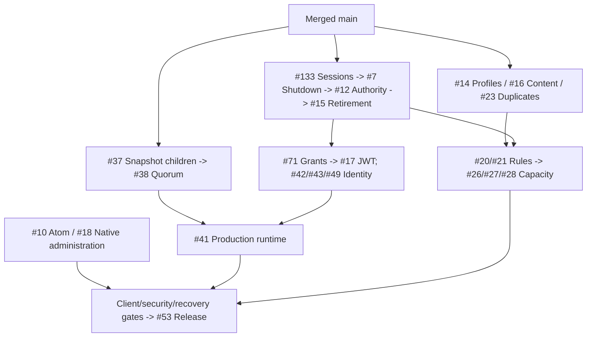
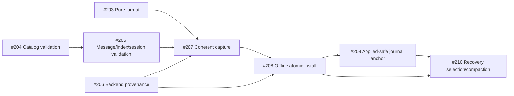

# Completion Roadmap

Switchyard is pre-alpha. Only merged `main` counts as complete. The
[issue board](https://github.com/DeandreT/switchyard/issues) owns scope, assignment
and acceptance; [compatibility](compatibility.md) owns tested guarantees.

## Main Progress

- [x] Repository-owned AMQP TCP/TLS/WSS and SASL/CBS SAS; queue delivery/settlement,
  DLQ, deferral, peek, sessions, scheduling and queue duplicates.
- [x] Actionless topic fanout, rules/subscriptions and bounded topology; ordinary
  queue-profile updates and selected profile/rule/capacity integrity.
- [x] Memory/Fjall storage and format-2 ownership; opt-in journal, atomic indexed
  apply and same-store committed replay (#144/#145/#36). Production still refuses.
- [x] Bound local authority, pure JWT/SQL kernels; native/link-family lifecycle
  custody through #132. Connection-owned sessions remain #133.
- [x] Source-bound build custody and four experimental Memory SDK TCP/WSS gates.
  Declared-current/previous pins are not latest or a durable compatibility matrix.
- [ ] Remaining semantics, administration and conserved physical-byte capacity.
- [ ] Full recovery, quorum, multi-tenant security and measured release.

## Next Main Increments

Lifecycle: #133 -> listener/deadline/signals #7 -> retained wire authority #12 ->
retirement/recreation #15. Snapshot children can proceed alongside that lane.
Joins are not Close acknowledgements; no finite latency is inferred.

`feat/amqp-message-sections` and `feat/topic-mode-metadata` are references, not
whole-branch ports. Preserve key tags, the 2,000-child bound and error/Clock
contracts; account for capabilities before retiring references.

## Snapshot Recovery

#36 local replay is complete; #37 full-state recovery is not. Each child is one
focused main-based PR. The six unfinished snapshot children retain their listed
dependencies; only #204 is available for unassigned pickup.

- [x] #203 Pure record format.
- [ ] #204 Catalog validation (ready, unassigned).
- [ ] #205 Message/index/session validation (blocked).
- [x] #206 Backend provenance, including #212 known-handle identity refusal.
- [ ] #207 Coherent capture (blocked).
- [ ] #208 Offline atomic install (blocked).
- [ ] #209 Applied-safe journal anchor (blocked).
- [ ] #210 Recovery selection/compaction (blocked).

Pure format does not prove store health. Capture must validate the exact complete
image; install requires all-writer exclusivity. Pruning stops at applied A, not
committed C. Sequence/token counters are not byte quotas. Quorum #38, runtime #41
and encrypted backup #47 remain separate.

## Parallel Pickup

Assign before coding; split multi-PR scopes and merge prerequisites first.
`status:ready` is a coordination hint, not evidence. Serialize shared files and
disk-aware two-job builds; see [workflow](../CONTRIBUTING.md).

| Lane | Entry / overlap boundary |
| --- | --- |
| Lifecycle | [#133](https://github.com/DeandreT/switchyard/issues/133); serialize listener/native/registry. |
| Domain | [#14](https://github.com/DeandreT/switchyard/issues/14), [#16](https://github.com/DeandreT/switchyard/issues/16), [#23](https://github.com/DeandreT/switchyard/issues/23); serialize command/codec/key tags. |
| Snapshots | [#204](https://github.com/DeandreT/switchyard/issues/204) catalog is ready/unassigned; #205/#207-#210 are blocked. [#203](https://github.com/DeandreT/switchyard/issues/203) format and [#206](https://github.com/DeandreT/switchyard/issues/206) provenance are merged. |
| Administration | [#10](https://github.com/DeandreT/switchyard/issues/10) Atom fixtures, [#18](https://github.com/DeandreT/switchyard/issues/18) native contract; no listener activation. |
| Deferred | [#71](https://github.com/DeandreT/switchyard/issues/71) grant consumers and [#101](https://github.com/DeandreT/switchyard/issues/101) SDK matrix await #7; serialize authorization/CBS/client programs. |

## Milestones

| Milestone | Remaining work |
| --- | --- |
| [M1](https://github.com/DeandreT/switchyard/milestone/1) Foundations | Lifecycle, retained authority, profiles, retirement, typed content. |
| [M2](https://github.com/DeandreT/switchyard/milestone/2) Compatibility | SDK/admin gates, sustained Flow, rules/actions, sessions/TTL, conserved capacity, same-group transactions/forwarding. |
| [M3](https://github.com/DeandreT/switchyard/milestone/3) Production | Snapshots/quorum/runtime, identity/RBAC/fairness, KMS/audit/backup, readiness/fault/upgrade and signed measured release. |

## Completion Checks

- [ ] **Foundation:** live owner health, retained-authority fencing, bounded lifecycle
  and format refusal/reopen gates are merged; no stale path can mutate a new entity.
- [ ] **Compatibility:** declared current/previous SDK and administration clients
  exercise supported semantics, rules, sessions, TTL, modes and transactions;
  remaining deviations are explicit and unsupported requests refuse.
- [ ] **Capacity:** physical-byte conservation covers every queue/topic lifecycle
  and copy/error route; no public finite profile exists without its ledger.
- [ ] **Production:** all proposals/timers/consistent reads use real quorum routing,
  with no local fallback; quotas, identity, KMS encryption and committed audit pass.
- [ ] **Recovery:** full-state restart/install/compaction, partitions, key rotation,
  corrupt-backup refusal and empty-cluster restore pass under faults.
- [ ] **Release:** signed Linux x64/arm64 artifacts/SBOMs plus published three-replica,
  encrypted/audited 100k 1KiB messages/s and under-20ms p99 evidence; 5TiB soak
  includes compaction, failover, backup and restore on declared hardware.

[#53](https://github.com/DeandreT/switchyard/issues/53) reaches every lane. Executed
evidence, not code presence or skipped tests, closes gates; 1.0 stays reserved.
[Architecture](../ARCHITECTURE.md) retains non-goals: Premium, cross-group atomic
transactions, geo replication and regulatory certification.
