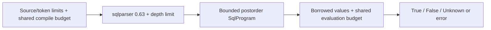

# SQL Predicates

The domain exposes an ephemeral typed predicate kernel, not persisted SQL rules
or subscription routing. `SqlProgram::compile` (or `compile_with_budget`) builds
a program; `evaluate(SqlMessageContext, &mut SqlEvaluationBudget)` returns
`SqlTruth` or an error. Only `True.is_match()` matches; `Unknown` does not.

## Accepted Profile

| Form | Contract |
| --- | --- |
| Boolean | `NOT`, `AND`, `OR`, parentheses; three-valued logic |
| Comparison | `=`, `<>`/`!=`, `<`, `<=`, `>`, `>=`; no implicit string/number coercion |
| Null/existence | Property `IS [NOT] NULL`, `[NOT] EXISTS(property)` |
| Membership | Scalar `[NOT] IN (scalar, ...)`; 1 through 32 operands |
| Pattern | Scalar `[NOT] LIKE scalar [ESCAPE scalar]`; `%`/`_`, ordinal whole-input matching |
| Properties | Bare/user-qualified names, double-quoted or bracket-quoted names; explicit `sys` whitelist |
| Literals | Boolean, null, single-quoted string, signed `i64`, finite `f64`; unary `+`/`-` only on numeric literals |

Numeric/string scalar roots can compile, but evaluate as `NonPredicate`.
Arithmetic, other functions, parameters, statements/subqueries and
actions are not accepted by this increment.

Membership input/list entries, LIKE input/pattern/escape, and their parentheses
accept properties or literals, including signed numeric literals. Predicate
expressions are not scalar operands. LIKE ANY, ILIKE, SIMILAR TO, bracket
wildcards and regular-expression syntax are not added.

## Values And Errors

`SqlMessageContext` borrows application/system entries; `SqlValue` retains
eight integral widths, `Float`/`Double`, Boolean, string, null or Unsupported.
User names compare ASCII-insensitively; non-ASCII spelling stays distinct.
Duplicate matching entries refuse as `AmbiguousProperty`.

Missing user properties are Unknown: comparisons propagate Unknown, `IS NULL`
is true and `EXISTS` is false. Explicit null also makes `IS NULL` true, but
`EXISTS` is true. Supported system inputs are `CorrelationId`, `MessageId`, `To`,
`ReplyTo`, `Subject` (`Label` alias), `SessionId`, `ReplyToSessionId`, `ContentType`.
An absent requested system entry is `MissingSystemProperty`; adapters must
supply explicit null for known nullable entries. Unknown system names refuse.

Every referenced Unsupported value errors, including EXISTS/IS NULL and
null comparisons. Boolean evaluation does not short-circuit away errors or
budget charges, even under `FALSE AND ...` or `TRUE OR ...`.
Strings use ordinal, case-sensitive equality/inequality; ordering refuses. Booleans support equality/inequality only.

Numeric comparisons use a local C#-style profile: Double promotion precedes
Float. Integral comparisons reject signed properties against Ulong, but allow
nonnegative integer literals. Narrower integral comparisons remain exact;
floating promotion can lose precision. Typed NaN compares false for equality
and ordering against numeric operands, true for inequality; typed infinities
are allowed. This subset does not claim universal Azure type behavior.

## Membership And Patterns

IN compares the input to every list entry using the existing typed equality
contract. Any true comparison yields True; otherwise any null/missing comparison
yields Unknown; otherwise the result is False. NOT IN negates that result,
preserving Unknown. Later incompatible, unsupported, ambiguous or missing-system
operands still error even after a match. Mixed non-null types do not coerce.

LIKE is case-sensitive and matches the entire string. `%` matches zero or more
Unicode scalars, `_` exactly one, including newlines. A combining sequence can
contain multiple scalars; a supplementary character is one scalar. Every other
character is literal, including brackets and regex punctuation. There is no
implicit escape. ESCAPE must be a string containing exactly one Unicode scalar;
it quotes any following scalar, including itself. A trailing unpaired escape is
malformed. Literal malformed patterns/escape lengths refuse compilation when
known; property-backed cases refuse evaluation deterministically.

Missing/null input, pattern or escape produces Unknown. Escape and pattern
validation precedes input null propagation: a non-string pattern/escape errors
even with null input, and a valid string pattern's malformed escape or engine
limit cannot be hidden by null/incompatible input. Referenced input errors are
never converted to Unknown. Null/missing pattern or escape has no regex to build.
Resource limits outrank finite evaluation errors; otherwise the first error in
the program's postorder wins, as in the typed kernel.

The [Service Bus SQL syntax](https://learn.microsoft.com/en-us/azure/service-bus-messaging/service-bus-messaging-sql-filter)
describes scalar pattern/escape expressions and `%`/`_`. This local profile
deliberately excludes arithmetic/functions, defines Unicode scalar rather than
UTF-16-code-unit matching, and fixes malformed-pattern/error priority; it does
not claim service-wide equivalence for unspecified cases.

## Bounds

| Budget | Fixed ceiling |
| --- | --- |
| Each expression | 4,096 UTF-8 bytes; 1,024 UTF-16 units; 128 physical tokens including whitespace/comments; parser depth 32; 128 nodes; expression depth 32 |
| Shared compilation | 1,048,576 source bytes; 32,768 tokens; 32,768 nodes |
| Shared evaluation | 1,048,576 work units; 33,554,432 lookup/comparison bytes |
| Membership list | 32 scalar operands, independent of existing expression ceilings |
| LIKE pattern | 16,384 UTF-8 bytes, including property-backed patterns |
| Regex engine | 1,048,576-byte Thompson NFA build limit and final NFA size check |

Per-expression limits are fixed. `with_limits` can lower shared ceilings, never
raise them. Reusing a budget shares accumulated charges across calls; completed
charges remain after failure. Input counts/names and all referenced lookups are
charged before evaluation allocation; string comparisons charge full operands.

Existing source/literal ceilings remain unchanged: the independently larger
pattern ceiling is reachable through borrowed property values, not larger SQL
source strings. IN precharges its full input for every list entry plus every
entry's full string bytes, even after a match. LIKE precharges the full input,
pattern and escape; any repeated bound-pass property lookup is also charged.
Before slot or regex allocation, each LIKE reserves `10 * pattern_bytes + 9`
translation bytes, the 1 MiB engine allocation allowance, and transformed-source
work plus an engine-state allowance of `1 MiB / size_of::<State>()` work units,
using the maintained NFA's measured state layout rather than a scalar minimum.
Checked/saturating accounting cannot wrap or refund completed charges.

Patterns are translated into anchored literal-safe regexes and built per
evaluation with maintained `regex-automata` PikeVM, without a retained cache.
Before cache allocation/matching, evaluation additionally charges
`(input_bytes + 1) * NFA_states` work and a conservative capture-free cache
allowance of `64 * NFA_states + 32` bytes. The engine's build limit is approximate
and may apply to an intermediate representation; the final NFA is also checked.
Auxiliary compiler allocations are bounded by the fixed pattern/translation
profile, not claimed to be included in the NFA size measurement.
All IN/LIKE preflight reservations include Boolean-hidden branches and precede
regex validation/build work. Regex build/matching work shares the same evaluation
budget across calls, and matching may refuse an otherwise valid large pattern.

See the [API](../crates/domain/src/sql_filter.rs), [compiler](../crates/domain/src/sql_filter/compiler.rs), [evaluator](../crates/domain/src/sql_filter/evaluator.rs) and [tests](../crates/domain/tests/sql_filter.rs).
The next language increment is [#97 arithmetic/static lookup](https://github.com/DeandreT/switchyard/issues/97); [#20 integration](https://github.com/DeandreT/switchyard/issues/20) remains separate.
